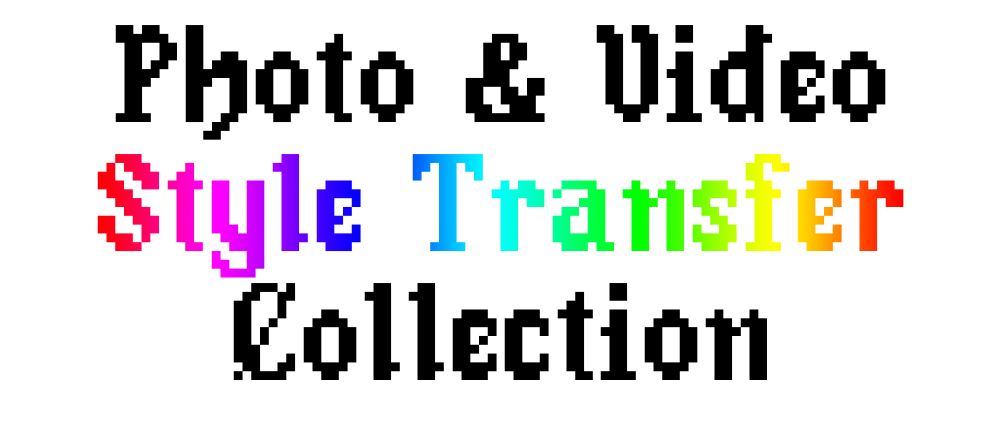

# Style-Transfer-Collection

Neural style transfer is an optimization technique used to take two images—a content image and a style reference image (such as an artwork by a famous painter)—and blend them together so the output image looks like the content image, but “painted” in the style of the style reference image.

This is implemented by optimizing the output image to match the content statistics of the content image and the style statistics of the style reference image. These statistics are extracted from the images using a convolutional network.

***To test a neural network online click on the “Open in Colab” button.***

**Photo Style Transfers based on:**

**1.** _pytorch_AdaIN.ipynb) **:** [pytorch-AdaIN](https://github.com/naoto0804/pytorch-AdaIN)

**2.** _PyTorch_Multi_Style_Transfer.ipynb) **:** [PyTorch-Multi-Style-Transfer](https://github.com/zhanghang1989/PyTorch-Multi-Style-Transfer)

**3.** _style_transfer.ipynb) **:** [style-transfer](https://github.com/jeremycochoy/style-transfer)

**4.** _Neural_Style_Transfer.ipynb) **:** [Neural-Style-Transfer](https://github.com/titu1994/Neural-Style-Transfer)

**5.** _neural_style.ipynb) **:** [neural-style](https://github.com/anishathalye/neural-style)

**6.** _artistic_style_transfer.ipynb) **:** [artistic-style-transfer](https://github.com/hnarayanan/artistic-style-transfer)

**Video Style Transfers based on:**

**1.** _pytorch_AdaIN.ipynb) **:** [pytorch-AdaIN](https://github.com/naoto0804/pytorch-AdaIN)

**2.** _PyTorch_Multi_Style_Transfer.ipynb) **:** [PyTorch-Multi-Style-Transfer](https://github.com/zhanghang1989/PyTorch-Multi-Style-Transfer)

**Example:**

